## Data Engineering Nanodegree - [Udacity](https://www.udacity.com/course/data-engineer-nanodegree--nd027)

### Section 1 - Introduction to Data Engineering

Why? Vital role in storing, organizing and making use of data.

**The Project Journey**
The projects will take you on a journey where you’ll assume the role of a Data Engineer at a fabricated data streaming company called “Sparkify” as it scales its data engineering in both size and sophistication. You’ll work with simulated data of listening behavior, as well as a wealth of metadata related to songs and artists. You’ll start working with a small amount of data, with low complexity, processed and stored on a single machine. By the end, you’ll develop a sophisticated set of data pipelines to work with massive amounts of data processed and stored on the cloud. There are five projects in the program. Below is a description of each.

**Project 1 - Data Modeling**
In this project, you’ll model user activity data for a music streaming app called Sparkify. The project is done in two parts. You’ll create a database and import data stored in CSV and JSON files, and model the data. You’ll do this first with a relational model in Postgres, then with a NoSQL data model with Apache Cassandra. You’ll design the data models to optimize queries for understanding what songs users are listening to. For PostgreSQL, you will also define Fact and Dimension tables and insert data into your new tables. For Apache Cassandra, you will model your data to help the data team at Sparkify answer queries about app usage. You will set up your Apache Cassandra database tables in ways to optimize writes of transactional data on user sessions.

**Project 2 - Cloud Data Warehousing**
In this project, you’ll move to the cloud as you work with larger amounts of data. You are tasked with building an ELT pipeline that extracts Sparkify’s data from S3, Amazon’s popular storage system. From there, you’ll stage the data in Amazon Redshift and transform it into a set of fact and dimensional tables for the Sparkify analytics team to continue finding insights in what songs their users are listening to.

**Project 3 - Data Lakes with Apache Spark**
In this project, you'll build an ETL pipeline for a data lake. The data resides in S3, in a directory of JSON logs on user activity on the app, as well as a directory with JSON metadata on the songs in the app. You will load data from S3, process the data into analytics tables using Spark, and load them back into S3. You'll deploy this Spark process on a cluster using AWS.

**Project 4 - Data Pipelines with Apache Airflow**
In this project, you’ll continue your work on Sparkify’s data infrastructure by creating and automating a set of data pipelines. You’ll use the up-and-coming tool Apache Airflow, developed and open-sourced by Airbnb and the Apache Foundation. You’ll configure and schedule data pipelines with Airflow, setting dependencies, triggers, and quality checks as you would in a production setting.

**Project 5 - Data Engineering Capstone**
The capstone project is an opportunity for you to combine what you've learned throughout the program into a more self-driven project. In this project, you'll define the scope of the project and the data you'll be working with. We'll provide guidelines, suggestions, tips, and resources to help you be successful, but your project will be unique to you. You'll gather data from several different data sources; transform, combine, and summarize it; and create a clean database for others to analyze.

**What is Data Engineering**

Data Engineering comprises all engineering and operational tasks required to make data available for the end-user, whether for the purposes of analytics, model building, app development, etc.

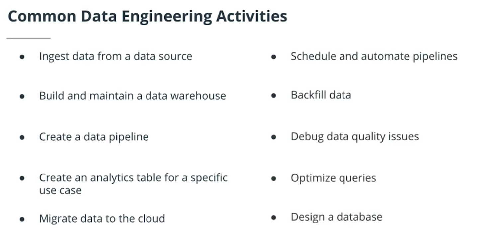

For the most part, Data Engineering design efficient ways to store data, running pipelines to transform and move data and prepping data by cleaning and summarizing to help the end-user. Core role is storing data in data warehouses and data lakes and running data pipelines!

1) [On the Evolution of Data Engineering](https://medium.com/analytics-and-data/on-the-evolution-of-data-engineering-c5e56d273e37): This short read (~5 minutes) focuses on the recent change from managing SQL databases to working with massive datasets in real time. It was written by Julien Kervizic, an experienced analytics expert from the Netherlands.

2) [Data Engineering Introduction and Epochs](https://learn.panoply.io/hubfs/Data%20Engineering%20-%20Introduction%20and%20Epochs.pdf): This slightly longer read (~20 minutes) goes further back in time to the birth of computers. It walks through four "epochs" of data engineering, and the major advances over the past 70 years. It was written by Panopoly, a data engineering platform provider.

**Data Engineering Tools**

- https://www.burtchworks.com/2018/09/10/the-rise-of-data-engineering-common-skills-and-tools/
- https://www.analyticsindiamag.com/data-engineering-101-top-tools-and-framework-resources/
- https://joviam.com/this-infographic-of-big-data-tools-will-blow-your-mind-infographic/
- https://datafloq.com/big-data-open-source-tools/os-home/

### Section 2 - Data Modeling

#### Lesson 1 - Introduction to Data Modeling

> In this lesson, students will learn the basic difference between relational and non-relation databases, and how each type of database fits the diverse needs of data consumers. 

**What is a Data Model?**

> "... an abstraction that organizes elements of data and how they relate to each other" --Wikipedia
> Data Modeling can easily translate to database modeling, as this is the essential end state.

**Common Questions**

1. Why can't everything be stored in a giant Excel spreadsheet?

There are limitations to the amount of data that can be stored in an Excel sheet. So, a database helps organize the elements into tables - rows and columns, etc. Also reading and writing operations on a large scale is not possible with an Excel sheet, so it's better to use a database to handle most business functions.

2. Does data modeling happen before you create a database, or is it an iterative process?

It's definitely an iterative process. Data engineers continually reorganize, restructure, and optimize data models to fit the needs of the organization.

3. How is data modeling different from machine learning modeling?

Machine learning includes a lot of data wrangling to create the inputs for machine learning models, but data modeling is more about how to structure data to be used by different people within an organization. You can think of data modeling as the process of designing data and making it available to machine learning engineers, data scientists, business analytics, etc., so they can make use of it easily.

We focus on the physical data model to create Data Definition Languages (DDL's) in Relational and Non-Relational databases.

- Data organization is critical!
- Organized data determines later data use. Queries that could have been straightforward and simple might become complicated queries if data modeling isn't well thought out.
- Begin prior to building out application, business logic and analytic models.
- Iterative process! Data modeling is not a fixed process. It is iterative as new requirements and data are introduced. Having flexibility will help as new information becomes available.

**Relational vs NoSQL Databases**

**Relational Model**

The software system used to maintain relational databases is a relational database management system or **RDBMS**. Invented by IBM in the late 60s.
Structured Query Language or **SQL** is the language used across almost all relational database systems for querying and maintaining the database.
Examples: Oracle, Teradata, MySql, PostgreSQL, Sqlite.

A **Schema** is a collection of tables. **Tables/Relation** is a group of rows sharing the same labeled elements. **Columns/Attributes** are labeled elements. **Rows/Tuple** is a single item.

**When to Use a Relational Database**

- Ease of use -- SQL
- Ability to do JOINS
- Ability to do aggregations and analytics
- Smaller data volumes - not Big Data!
- Easier to change to business requirements
- Flexibility for queries
- Modeling the data not modeling the queries
- Secondary Indexes available: You have the advantage of being able to add another index to help with quick searching.
- ACID Transactions: Allows you to meet a set of properties of database transactions intended to guarantee validity even in the event of errors, power failures, and thus maintain data integrity.

**ACID Transactions**

> "... properties of database transactions intended to guarantee validity even in the event of errors, power failures,..." -- Wikipedia

**Atomicity**: The whole transaction is processed or nothing is processed. A commonly cited example of an atomic transaction is money transactions between two bank accounts. The transaction of transferring money from one account to the other is made up of two operations. First, you have to withdraw money in one account, and second you have to save the withdrawn money to the second account. An atomic transaction, i.e., when either all operations occur or nothing occurs, keeps the database in a consistent state. This ensures that if either of those two operations (withdrawing money from the 1st account or saving the money to the 2nd account) fail, the money is neither lost nor created.

**Consistency**: Only transactions that abide by constraints and rules are written into the database, otherwise the database keeps the previous state. The data should be correct across all rows and tables.

**Isolation**: Transactions are processed independently and securely, order does not matter. A low level of isolation enables many users to access the data simultaneously, however this also increases the possibilities of concurrency effects (e.g., dirty reads or lost updates). On the other hand, a high level of isolation reduces these chances of concurrency effects, but also uses more system resources and transactions blocking each other.

**Durability**: Completed transactions are saved to database even in cases of system failure. A commonly cited example includes tracking flight seat bookings. So once the flight booking records a confirmed seat booking, the seat remains booked even if a system failure occurs.

**When Not to Use a Relational Database**

- Have large amounts of data: Relational Databases are not distributed databases and because of this they can only scale vertically by adding more storage in the machine itself. You are limited by how much you can scale and how much data you can store on one machine. You cannot add more machines like you can in NoSQL databases.
- Need to be able to store different data type formats: Relational databases are not designed to handle unstructured data.
- Need high throughput -- fast reads: While ACID transactions bring benefits, they also slow down the process of reading and writing data. If you need very fast reads and writes, using a relational database may not suit your needs.
- Need a flexible schema: Flexible schema can allow for columns to be added that do not have to be used by every row, saving disk space.
- Need high availability: The fact that relational databases are not distributed (and even when they are, they have a coordinator/worker architecture), they have a single point of failure. When that database goes down, a fail-over to a backup system occurs and takes time.
- Need horizontal scalability: Horizontal scalability is the ability to add more machines or nodes to a system to increase performance and space for data.

**High Availability** - describes a database where there is very little **downtime** of the system, it is always **on** and **functioning**.
**Horizontal Scalability** - ability to add more nodes/servers to the system to increase performance.

**What is PostgreSQL**

- Open source object-relational database system
- Uses and builds on SQL language
- Refer to `Lesson 1 Demo 0`, `Lesson 1 Demo 1`, `Lesson 1 Exercise 1`.

**NoSQL Databases**

> "... has a simpler design, simpler horizontal scaling, and finer control of availability. Data structures used are different than those in Relational Databases nd they make some operations faster.

- NoSQL and NonRelational are interchangeable.
- Also invented in the late 70s but became more popular in the 2000s as data sizes became bigger and less downtimes became acceptable. It was built to solve the limitations of the Relational DBs.
- Apache Cassandra (Partition Row Store) | MongoDB (Document Store) | DynamoDB (Key-Value Store) | Apache HBase (Wide Column Store) | Neo4J (Graph Database)
- Specific to Apache Cassandra: `Keyspace` (collection of tables), `Table` (Group of partitions) and `Rows` (single item).

**Apache Cassandra**

> "... provides scalability and high availability without compromising performance. Linear Scalability and proven fault-tolerance on commodity hardware or cloud infrastructure make it perfect platform for mission-critical data."

- Uses its own query language CQL.

What type of companies use Apache Cassandra?

All kinds of companies. For example, Uber uses Apache Cassandra for their entire backend. Netflix uses Apache Cassandra to serve all their videos to customers. Good use cases for NoSQL (and more specifically Apache Cassandra) are:

- Transaction logging (retail, health care)
- Internet of Things (IoT)
- Time series data
- Any workload that is heavy on writes to the database (since Apache Cassandra is optimized for writes).

Would Apache Cassandra be a hindrance for my analytics work? If yes, why?

Yes, if you are trying to do analysis, such as using `GROUP BY` statements. Since Apache Cassandra requires data modeling based on the query you want, you can't do ad-hoc queries. However you can add clustering columns into your data model and create new tables.

**When to use a NoSQL Database**

- Need to be able to store different data type formats: NoSQL was also created to handle different data configurations: structured, semi-structured, and unstructured data. JSON, XML documents can all be handled easily with NoSQL.
- Large amounts of data: Relational Databases are not distributed databases and because of this they can only scale vertically by adding more storage in the machine itself. NoSQL databases were created to be able to be horizontally scalable. The more servers/systems you add to the database the more data that can be hosted with high availability and low latency (fast reads and writes).
- Need horizontal scalability: Horizontal scalability is the ability to add more machines or nodes to a system to increase performance and space for data
- Need high throughput: While ACID transactions bring benefits they also slow down the process of reading and writing data. If you need very fast reads and writes using a relational database may not suit your needs.
- Need a flexible schema: Flexible schema can allow for columns to be added that do not have to be used by every row, saving disk space.
- Need high availability: Relational databases have a single point of failure. When that database goes down, a failover to a backup system must happen and takes time.

So bottom line: built for Big Data and to provide users with low latency.

**When NOT to use a NoSQL Database**

- When you have a small dataset: NoSQL databases were made for big datasets not small datasets and while it works it wasn’t created for that.
- When you need ACID Transactions: If you need a consistent database with ACID transactions, then most NoSQL databases will not be able to serve this need. NoSQL database are eventually consistent and do not provide ACID transactions. However, there are exceptions to it. Some non-relational databases like MongoDB can support ACID transactions.
- When you need the ability to do JOINS across tables: NoSQL does not allow the ability to do JOINS. This is not allowed as this will result in full table scans.
- If you want to be able to do aggregations and analytics.
- If you have changing business requirements: Ad-hoc queries are possible but difficult as the data model was done to fix particular queries.
- If your queries are not available and you need the flexibility: You need your queries in advance. If those are not available or you will need to be able to have flexibility on how you query your data you might need to stick with a relational database.

*Caveats to NoSQL and ACID Transactions*
There are some NoSQL databases that offer some form of ACID transaction. As of v4.0, MongoDB added multi-document ACID transactions within a single replica set. With their later version, v4.2, they have added multi-document ACID transactions in a shared/partitioned deployment.

> NoSQL databases and Relational databases do not replace each other for all tasks. Both do different tasks extremely well, and should be utilized for the use cases they fit best.

- Does not allow for duplicates as opposed to PostgreSQL.
- Refer to `Lesson 1 Demo 2` and `Lesson 1 Exercise 2`.

#### Lesson 2 - Relational Data Models

> Students will learn the fundamentals of how to do relational data modeling by focusing on normalization, denormalization, fact/dimension tables, and different schema models.

Definitions:

- Database: set of related data and the way it is organized.
- DBMS: computer system that allows users to interact with the databases and provides access to all of the data. Because of the close relationship, the term database is often used to refer to both the database and the DBMS used.

*Rule 1: The information rule*
All information in a relational database is represented explicitly at the logical level and in exactly one way – by values in tables.

- **Online Analytical Processing (OLAP)**
Databases optimized for these workloads allow for complex analytical and ad hoc queries, including aggregations. These type of databases are optimized for reads.

- **Online Transactional Processing (OLTP)**
Databases optimized for these workloads allow for less complex queries in large volume. The types of queries for these databases are read, insert, update, and delete.

The key to remember the difference between OLAP and OLTP is analytics (A) vs transactions (T). If you want to get the price of a shoe then you are using OLTP (this has very little or no aggregations). If you want to know the total stock of shoes a particular store sold, then this requires using OLAP (since this will require aggregations).

Structuring the database:
- **Normalization**: To reduce redundancy and increase data integrity. The process of structuring a relational database in accordance with a series of normal forms in order to reduce data redundancy and increase data integrity. We want fewer copies and that our records are the single source of truth. The table below is not normalized.

- **Denormalization**: Must be done in read heavy workloads ato increase performance.

Objectives of **Normal Form**:
- To free the database from unwanted insertions, updates, and deletion dependencies. The fewer places you need to update the data, less prone to error you are...
- To reduce the need for refactoring the database as new types of data are introduced.
- To make the relational model more informative to users.
- To make the database neutral to the query statistics.

**Normal Forms**

- Normalization is a step by step process. There are more than three but not really done in production, more for academics.

**How to reach First Normal Form (1NF)**

- Atomic values: each cell contains unique and single values
- Be able to add data without altering tables (adding or removing columns)
- Separate different relations into different tables
- Keep relationships between tables together with foreign keys

**Second Normal Form (2NF)**

- Have reached 1NF
- All columns in the table must rely on the Primary Key

In the example below, the store ID is not unique and so we need two columns to get a unique record. So we break the bigger table down into two smaller ones.

**Third Normal Form (3NF)**

- Must be in 2nd Normal Form
- No transitive dependencies
- Remember, transitive dependencies you are trying to maintain is that to get from A-> C, you want to avoid going through B.

In the first table, we need to know `music award` + `year` to identify one `winner record of year`. And then the `lead singer` is extra info. Jon Lennon is repeated in rows 1 and 3. Then if that was updated, we would need to update in multiple locations...

**When to use 3NF**

When you want to update data, we want to be able to do in just 1 place. 

- Refer to `Lesson 2 Demo 1` and `Lesson 2 Exercise 1`.

**Denormalization**

> The process of trying to improve the read performance of a database at the expense of losing some write performance by adding redundant copies of data.

JOINS on the database allow for outstanding flexibility but are extremely slow. If you are dealing with heavy reads on your database, you may want to think about denormalizing your tables. You get your data into normalized form, and then you proceed with denormalization. So, denormalization comes after normalization.

Requires more space in the system but now space is not really a limiting factor. Denormalization is part of the data modeling process to make data more easily queried. We want to think about the queries that we are running and how we can reduce our number of JOINS even if that means duplicating data. 

Logical Design Change:
- The designer is in charge of keeping the data consistent (all copies are consistent at any time)
- Reads will be fast (select)
- Writes will be slower (insert, update, delete)

In summary:

- Normalization is about trying to increase data integrity by reducing the number of copies of the data. Data that needs to be added or updated will be done in as few places as possible.

- Denormalization is trying to increase performance by reducing the number of joins between tables (as joins can be slow). Data integrity will take a bit of a potential hit, as there will be more copies of the data (to reduce JOINS).

- Refer to `Lesson 2 Demo 2` and `Lesson 2 Exercise 2`.

Example of Denormalized Data:
As you saw in the earlier demo, this denormalized table contains a column with the Artist name that includes duplicated rows, and another column with a list of songs.

Example of Normalized Data:
Now for normalized data, Amanda used 3NF. You see a few changes:
1) No row contains a list of items. For e.g., the list of song has been replaced with each song having its own row in the Song table.
2) Transitive dependencies have been removed. For e.g., album ID is the PRIMARY KEY for the album year in Album Table. Similarly, each of the other tables have a unique primary key that can identify the other values in the table (e.g., song id and song name within Song table).

**Fact and Dimension Tables**

- Work together to create an organized data model
- While fact and dimension are not created differently in the DDL, they are conceptual and extremely important for the organization.
- One or more fact table(s) for each dimension table.
- Fact tables consist of the measurements, metrics or facts of a business process. Not meant to be updated in place like a dimension table would. Normally have numbers. 
- Dimension is a structure that categorizes facts and measures in order to enable users to answer business questions. Dimensions are people, products, place and time. Include textual and numerical information not used for analysis. 

Two of the most popular data mart schema for data warehouses are:
- **Star Schema**
- **Snowflake Schema**

**Star Schema** is the simplest style of data mart schema. The start schema consists of one or more fact tables referencing any number of dimension tables.

In this example, it helps to think about the Dimension tables providing the following information:

Where the product was bought? (Dim_Store table)
When the product was bought? (Dim_Date table)
What product was bought? (Dim_Product table)

The Fact table provides the metric of the business process (here Sales).

How many units of products were bought? (Fact_Sales table)

Why "star" schema?
- Gets its name from the physical model resembling a star shape
- a fact table is at its center
- dimension table surrounds the fact table representing the star's points.

Benefits of star schema:
- Denormalized
- Simplifies queries
- Fast aggregations

Disadvantages:
- Issues that come with denormalization 
- Data integrity
- Decrease query flexibility
- Many to many relationships -- simplified

**Snowflake Schema** is a logical arrangement of tables in a multidimensional database represented by centralized fact tables which are connected to multiple dimensions. A complex snowflake shape emerges when the dimensions of a snowflake schema are elaborated, having multiple levels of relationships, child tables having multiple parents.

The star schema is a simplified case of the snowflake schema. The star schema does no allow for one to many relationships while the snowflake schema does. The snowflake schema is more normalized that the star schema, but only in 1NF or 2NF.

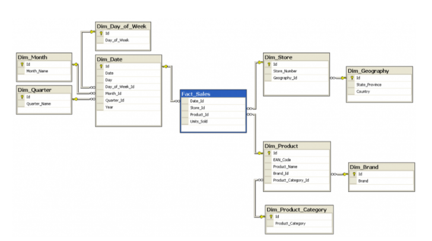

[Medium post on the differences between Star and Snowflake Schemas](https://medium.com/@BluePi_In/deep-diving-in-the-world-of-data-warehousing-78c0d52f49a)

- Refer to `Lesson 2 Demo 3` and `Lesson 2 Exercise 3`.

- Refer to `Project 1`.

#### Lesson 3 - NoSQL Data Models

> Students will learn the fundamentals of data modeling or NoSQL databases, focusing on the basics of NoSQL database design, denormalization, primary keys, clustering columns, and the WHERE clause.

- NoSQL and Non-Relational are interchangeable terms
- NoSQL = Not only SQL

**When Not to Use SQL**

- Need high Availability in the data: Indicates the system is always up and there is no downtime
- Have Large Amounts of Data
- Need Linear Scalability: The need to add more nodes to the system so performance will increase linearly
- Low Latency: Shorter delay before the data is transferred once the instruction for the transfer has been received.
- Need fast reads and writes
- Apache Cassandra is an example of a NoSQL database

Here is a helpful blog that describes the different types of NoSQL databases - <https://www.xenonstack.com/blog/nosql-databases/>.

**Apache Cassandra**
- Open source
- Masterless architecture
- High availability - no single point of failure
- Linearly scalable
- Used by Uber, Netflix, Twitter, Facebook...
- Created to handle big data challenges that relational databases failed to tackle

In a distributed database, in order to have high availability you will need copies of your data. It is made up of multiple machines (horizontally scaled). Since there are copies of data to cope with eventual nodes crashing, data might not be up-to-date in all nodes - **eventual consistency**.

**Eventual Consistency:**
Over time (if no new changes are made) each copy of the data will be the same, but if there are new changes, the data may be different in different locations. The data may be inconsistent for only milliseconds. There are workarounds in place to prevent getting stale data. Or, in other words, a consistency model used in distributed computing to achieve high availability at informally guarantees that, f no new updates are made to a given data item, eventually all accesses to that item will return the last updated value.

**CAP Theorem:**
> It is impossible for a distributed data store to simultaneously provide more than two out of three guarantees of consistency, availability and partition tolerance.

**Consistency**: Every read from the database gets the latest (and correct) piece of data or an error

**Availability**: Every request is received and a response is given -- without a guarantee that the data is the latest update

**Partition Tolerance**: The system continues to work regardless of losing network connectivity between nodes

When there is no network failures, it is possible to achieve consistency and availability. However, if there is a network failure, you may only have consistency or availability. Apache Cassandra chooses to be highly available at the potential cost of consistency! It is a `AP` type of database.

***Commonly Asked Questions:***
- Is Eventual Consistency the opposite of what is promised by SQL database per the ACID principle?

Much has been written about how Consistency is interpreted in the ACID principle and the CAP theorem. Consistency in the ACID principle refers to the requirement that only transactions that abide by constraints and database rules are written into the database, otherwise the database keeps previous state. In other words, the data should be correct across all rows and tables. However, consistency in the CAP theorem refers to every read from the database getting the latest piece of data or an error.

- Which of these combinations is desirable for a production system - Consistency and Availability, Consistency and Partition Tolerance, or Availability and Partition Tolerance?

As the CAP Theorem Wikipedia entry says, "The CAP theorem implies that in the presence of a network partition, one has to choose between consistency and availability." So there is no such thing as Consistency and Availability in a distributed database since it must always tolerate network issues. You can only have Consistency and Partition Tolerance (CP) or Availability and Partition Tolerance (AP). Remember, relational and non-relational databases do different things, and that's why most companies have both types of database systems.

- Does Cassandra meet just Availability and Partition Tolerance in the CAP theorem?

According to the CAP theorem, a database can actually only guarantee two out of the three in CAP. So supporting Availability and Partition Tolerance makes sense, since Availability and Partition Tolerance are the biggest requirements.

- If Apache Cassandra is not built for consistency, won't the analytics pipeline break?

If I am trying to do analysis, such as determining a trend over time, e.g., how many friends does John have on Twitter, and if you have one less person counted because of "eventual consistency" (the data may not be up-to-date in all locations), that's OK. In theory, that can be an issue but only if you are not constantly updating. If the pipeline pulls data from one node and it has not been updated, then you won't get it. Remember, in Apache Cassandra it is about Eventual Consistency.

**Denormalization in Apache Cassandra**

- Denormalization is not just okay -- it's a must
- Denormalization must be done for fast reads
- Apache Cassandra has been optimized for fast writes
- ALWAYS think Queries first
- One table per query is a great strategy
- Apache Cassandra does not allow for JOINs between tables

If migrating from SQL to NoSQL the data model will need to be redesigned, migration as is will not work. 3NF does not work, there are not joins! Storage isn't expensive, losing customers to low performance or outages is. Apache Cassandra requires a paradigm shift from thinking about queries in relational databases. It is 1 table per single query.

- I see certain downsides of this approach, since in a production application, requirements change quickly and I may need to improve my queries later. Isn't that a downside of Apache Cassandra?

In Apache Cassandra, you want to model your data to your queries, and if your business need calls for quickly changing requirements, you need to create a new table to process the data. That is a requirement of Apache Cassandra. If your business needs calls for ad-hoc queries, these are not a strength of Apache Cassandra. However keep in mind that it is easy to create a new table that will fit your new query.

- Cassandra Query Language (CQL) is the way to interact with the database and is very similar to SQL. JOINS, GROUP BY, or subqueries are not in CQL and are not supported by CQL.

- Refer to `Lesson 3 Demo 1` and `Lesson 3 Exercise 1`.

**Primary Key**

- How each row can be uniquely identified and how the data is distributed across the nodes (or servers) in our system.
- The first element of the `PRIMARY KEY` is the `PARTITION KEY` which will determine the distribution.
- The `PARTITION KEY`'s row value will be hashed (turned into a number) and stored on the node in the system that holds the range of values.
- Must be unique.
- The `PRIMARY KEY` is made up of either just the `PARTITION KEY` or may also include additional `CLUSTERING COLUMNS`.
- A Simple `PRIMARY KEY` is just one column that is also the `PARTITION KEY`. A `Composite PRIMARY KEY` is made up of more than one column and will assist in creating a unique value and in your retrieval queries.
- The `PARTITION KEY` will determine the distribution of data across the system. We want to pick a key that will evenly distribute the data. Ex: is it's state it will not be evenly distribute since different states have different population sizes.

- Which is better: Simple or Composite Primary Keys?

It depends on the data you have and the queries you will run. You may need to combine several columns in the Primary Key to make a Composite Key so that each of the rows are unique.

- Refer to `Lesson 3 Demo 2` and `Lesson 3 Exercise 2`.

**Clustering Columns:**
- The clustering column will sort the data in sorted ascending order, e.g., alphabetical order. 
- More than one clustering column can be added (or none!).
- From there the clustering columns will sort in order of how they were added to the primary key.

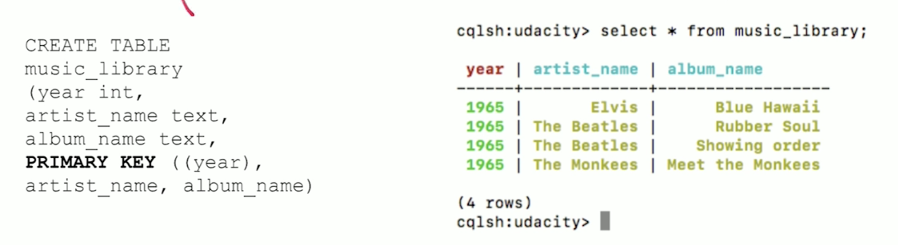

- How many clustering columns can we add?
You can use as many clustering columns as you would like. You cannot use the clustering columns out of order in the `SELECT` statement. You may choose to omit using a clustering column in your `SELECT` statement. That's OK. Just remember to use them in order when you are using the `SELECT` statement.

- Refer to `Lesson 3 Demo 3` and `Lesson 3 Exercise 3`.

**WHERE clause**
- Data Modeling in Apache Cassandra is query focused, and that focus needs to be on the `WHERE` clause.
- The `PARTITION KEY` must be included in your query and any `CLUSTERING COLUMNS` can be added in order they appear in your `PRIMARY KEY`.
- Failure to include a `WHERE` clause will result in an error.

- `SELECT * FROM TABLE`: the where clause must be included to execute queries. It is recommended that one partition be queried at a time for performance implications. It is possible to do a `select * from table` if you add a configuration `ALLOW FILTERING` to your query. This is risky, but available if absolutely needed.

- Why do we need to use a `WHERE` statement since we are not concerned about analytics? Is it only for debugging purposes?

The WHERE statement is allowing us to do the fast reads. With Apache Cassandra, we are talking about big data -- think terabytes of data -- so we are making it fast for read purposes. Data is spread across all the nodes. By using the WHERE statement, we know which node to go to, from which node to get that data and serve it back. For example, imagine we have 10 years of data on 10 nodes or servers. So 1 year's data is on a separate node. By using the WHERE year = 1 statement we know which node to visit fast to pull the data from.

- Refer to `Lesson 3 Demo 4` and `Lesson 3 Exercise 4`.

### Section 3 - Cloud Data Warehouses

#### Lesson 1 - Intro to Data Warehouses

> Students will be able to understand the purpose, architecture, and technologies used in a data warehouse.

What is a Data Warehouse?

- In a Business perspective:

- In a Technical perspective:

> A copy of transaction data specifically structured for query and analysis.

> Is a subject-oriented, integrated, nonvolatile, and time-variant collection of data in support of management's decisions.

> Is a system that retrieves and consolidates data periodically from the source systems into a dimensional and normalized data stores. It usually kee[s years of history and is queried for business intelligence or other analytical activities. It is typically updated in batches, not every time a transaction happens in the source system.

**Data Warehouse Goals**
- Simple to understand
- Performant
- Quality assured
- Handles new questions well
- Secure

- Refer to `Lesson 4 Exercise 1`.

**DWH Architecture**

According to Kimball's Bus Architecture, data is kept in a common dimension data model shared across different departments. It does not allow for individual department specific data modeling requirements.

Independent Data Marts are highly discouraged.

- The Enterprise Data Warehouse provides a normalized data architecture before individual departments build on it. 
- Corporate Information Factory (CIF) build on a 3NF normalized database and then allow for documented data denormalization for Data Marts. 
- Corporate Information Factory (CIF) build on a 3NF normalized database and then allow for documented data denormalization for Data Marts.

**DWH Technologies**

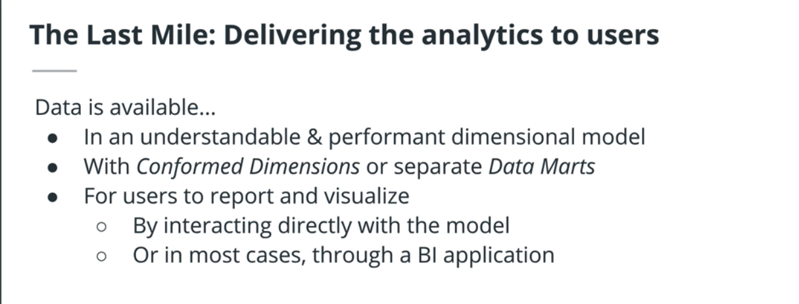

- OLAP cubes is a very convenient way of slicing, dicing and drilling down.

- How do serve these OLAP CUBES?
1. Approach 1: Pre-aggregate the OLAP cubes and saves them on a special purpose non-relational database (**MOLAP**)
2. Approach 2: Compute the OLAP cubes on the fly from the existing relational databases where the dimensioanal model redis (**ROLAP**)

### Lesson 2 - Introduction to Cloud Computing and AWS

> Welcome to this lesson on Introduction to the Cloud and AWS. You'll learn about the cloud infrastructure ecosystem and understand how to use essential tools for computing, storage, and analytics through one of the biggest providers of cloud computing, Amazon Web Services.

What Is **Cloud Computing**?
Cloud computing: the practice of using a network of remote servers hosted on the Internet to store, manage, and process data, rather than a local server or a personal computer.

The arrival of cloud computing completely changed the way we deploy our technology, providing powerful access to instant and scalable computing power to enterprises, startups, and developers alike. Whether you need servers to host a web application, reliable storage for your data, or machines to train machine learning models, it's easy to see the advantage of relying on the cloud rather than utilizing your personal computer or local servers.

For one, you no longer have to invest in lots of hardware upfront. No need to worry about whether you are paying for more than you'll need or what to do if you need to scale a lot more later on. Cloud computing makes this as easy and clicking a few buttons to scale your resources up or down.

It's significantly faster provisioning the resources you need through the cloud versus the time it would take to gather and build up the hardware you'd need to provide the same support. This allows you and your team, or company, to develop and experiment at a much faster rate.

Lastly, you can provide efficient access to your applications around the world by spreading your deployments to multiple regions.

**Amazon Web Services**
Amazon Web Services is one of the largest providers in the cloud computing industry, with over 140 services in compute, storage, databases, networking, developer tools, security, and more. In this lesson, we'll learn about a few essential tools and services in AWS and practice using them. These services can be accessed in three different ways: the AWS Management Console, the Command Line Interface (CLI), or Software Development Kits (SDKs), which can be used in combination.

We'll start with the AWS Management Console, which is the web user interface. The AWS CLI is a useful way to control and automate your services with code, and SDKs allow you to easily integrate services with your applications through APIs built around specific languages and platforms.

**Using AWS Management Console**
- Create an `IAM role` to attach to `Redshift cluster` to enable your cluster to load data from Amazon S3 buckets. Read more about IAM roles and Redshift [here](https://docs.aws.amazon.com/redshift/latest/gsg/rs-gsg-create-an-iam-role.html).
- Create `security group` to be used to authorize access to your Redshift cluster.
- Launch a Redshift cluster.
- Create an `IAM User` to be used to access Redshift cluster with `AmazonRedshiftFullAccess` and `AmazonS3ReadOnlyAccess`. Download CSV with credentials.
- Delete cluster to avoid unexpected costs.
- Create an S3 bucket and upload file to it.
- Create a PostgreSQL DB Instance using RDS.

**Implementing DWH on AWS**

> Students will be able to implement a data warehouse on AWS including scalable storage , ETL strategies, and design and query optimization. 

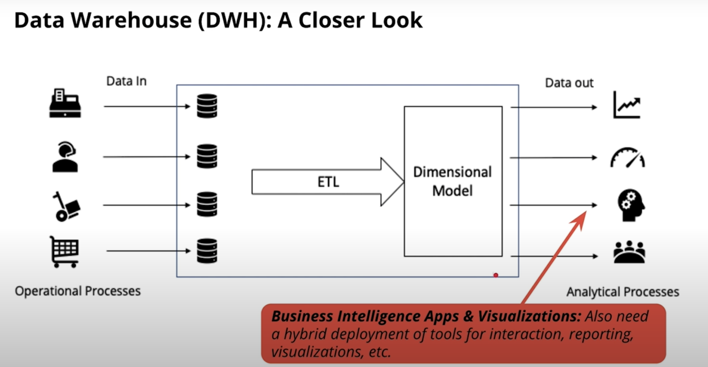

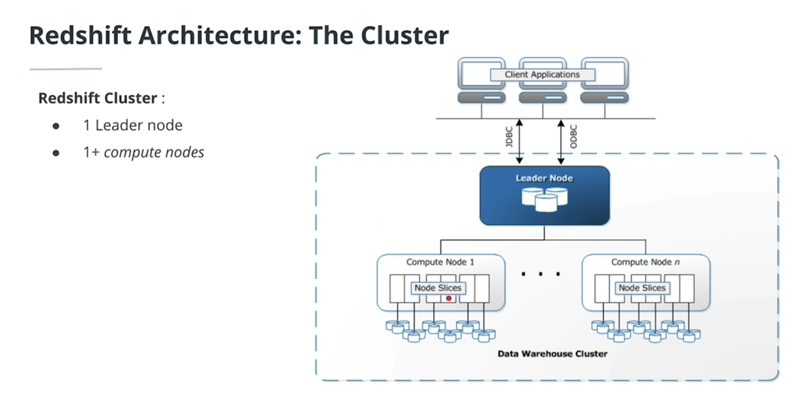

- The total number of nodes in a Redshift cluster is equal to: The number of AWS EC2 instances used in the cluster.
- Each slice in a Redshift cluster is: At least 1 CPU with dedicated storage and memory for the slice.
- If we have a Redshift cluster with 4 nodes, each containing 8 slices, i.e. the cluster collectively offers 32 slices. What is the maximum number of partitions per table? 32 partitions! The total number of slices in a cluster is our unit of parallelism and it is equal to the sum of all slices on the cluster.

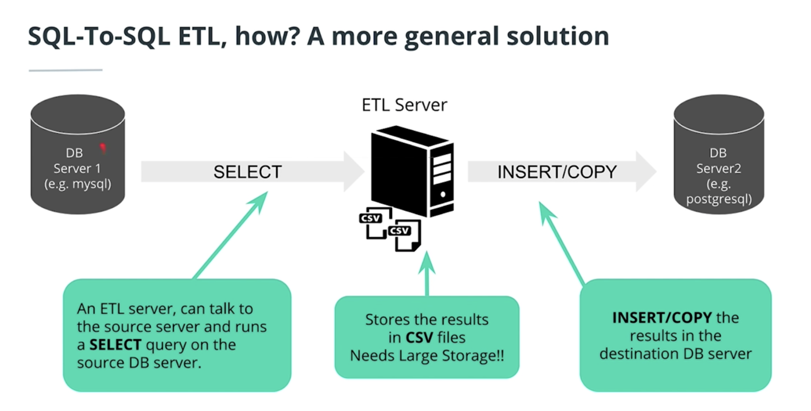

- ETL Servers talk to different databases and need to store data as it moves it from one place to the next. So they need to have large storage capacity!

- We store all the data in S3 buckets, we do not need storage on the EC2 machine. S3 offers a very reliable, scalable and worry-free storage solution, but it only offers storage not processing power.

- We can pre-aggregate data with OLAP cubes to feed BI apps and upload to S3. Redshift can also feed the BI apps directly though.
- We need the staging bucket since we will most likely transform the data before inserting it into the DHW.

- Bulk insertion in a SQL database is faster than doing it record by record.

- Why do we split a table into multiple files before ingestion? Because this way we can execute multiple simultaneous COPY commands. Each Redshift slice will act as a separate worker and will use ingest the split of a file in parallel, so the process will complete much faster.

- Usually you'll want to use S3 as a staging area, but for very small data, you might want to copy it directly from the EC2 machine.

- Which of the following are advantages of Infrastructure-as-Code over creating infrastructure by clicking-around? Sharing, Reproducibility, Multiple Deployments & Maintainability are all advantages of IaC. One can track all the steps with others easily. One can be sure that no steps are forgotten. One can create a test environment identical to the production environment. If a change is needed, one can keep track of the changes by comparing the code.

- Joining 2 tables distributed using an EVEN strategy is slow because records will have to be shuffled for putting together the JOIN result. Yes, because e.g. a given key (say key=2532) of table 1 will not be on the same slice as the corresponding record in table 2, so record will be copied (shuffled) between slices on different nodes, which results in slow performance.

Note: In general, dimension tables are small compared to fact tables.

### Section 4 - Data Lakes with Spark

#### Lesson 1 - The Power of Spark

Spark is currently one of the most popular tools for big data analytics. You might have heard of other tools such as Hadoop. Hadoop is a slightly older technology although still in use by some companies. Spark is generally faster than Hadoop, which is why Spark has become more popular over the last few years.

There are many other big data tools and systems, each with its own use case. For example, there are database system like Apache Cassandra and SQL query engines like Presto. But Spark is still one of the most popular tools for analyzing large data sets.

Here is an outline of the topics we are covering in this lesson:

- What is big data?
- Review of the hardware behind big data
- Introduction to distributed systems
- Brief history of Spark and big data
- Common Spark use cases
- Other technologies in the big data ecosystem

**The Numbers Everyone Should Know**
- How long does it take for your CPU to add two numbers?
- How quickly can you look up an appointment if your calendar is already chached in your computer's memory?
- How many seconds does it take to load up your favourite song from your laptop's SSD storage?
- How much data can you download from Netflix in a minute?

In the next few videos, you'll learn about four key hardware components. Understanding these components helps determine whether you are working on a "big data" problem or if it's easier to analyze the data locally on your own computer.

**CPU (Central Processing Unit)**
The CPU is the "brain" of the computer. Every process on your computer is eventually handled by your CPU. This includes calculations and also instructions for the other components of the compute.

**Memory (RAM)**
When your program runs, data gets temporarily stored in memory before getting sent to the CPU. Memory is ephemeral storage - when your computer shuts down, the data in the memory is lost.

**Storage (SSD or Magnetic Disk)**
Storage is used for keeping data over long periods of time. When a program runs, the CPU will direct the memory to temporarily load data from long-term storage.

**Network (LAN or the Internet)**
Network is the gateway for anything that you need that isn't stored on your computer. The network could connect to other computers in the same room (a Local Area Network) or to a computer on the other side of the world, connected over the internet.

Other Numbers to Know?
You may have noticed a few other numbers involving the L1 and L2 Cache, mutex locking, and branch mispredicts. While these concepts are important for a detailed understanding of what's going on inside your computer, you don't need to worry about them for this course.

CPU operations are fastest. Operations in memory (RAM) are the second fastest. Then comes hard disk storage and finally transferring data across a network. Keep these relative speeds in mind. They'll help you understand the constraints when working with big data.

The CPU is the brains of a computer. The CPU has a few different functions including directing other components of a computer as well as running mathematical calculations. The CPU can also store small amounts of data inside itself in what are called registers. These registers hold data that the CPU is working with at the moment.

For example, say you write a program that reads in a 40 MB data file and then analyzes the file. When you execute the code, the instructions are loaded into the CPU. The CPU then instructs the computer to take the 40 MB from disk and store the data in memory (RAM). If you want to sum a column of data, then the CPU will essentially take two numbers at a time and sum them together. The accumulation of the sum needs to be stored somewhere while the CPU grabs the next number.

This cumulative sum will be stored in a register. The registers make computations more efficient: the registers avoid having to send data unnecessarily back and forth between memory (RAM) and the CPU.

- Ex: No problem for a single machine to process one day of worldwide tweets. But there is a catch: most times our CPU isn't processing data but sitting idle as it waits for input from the memory. It takes 250x longer to load data from the memory than to process it. By loading data sequently, we can avoid this bottleneck.
- It seems like the right combination of CPU and memory can help you quickly load and process data. We could build a single computer with lots of CPUs and a ton of memory. The computer would be incredibly fast.
- Memory (aka RAM) is known to be "efficient, expensive, and ephemeral". Operations in RAM are relatively fast compared to reading and writing from disk or moving data across a network. However, RAM is expensive, and data stored in RAM will get erased when a computer shuts down.
- What are the potential trade offs of creating one computer with a lots of CPUs and memory? Beyond the fact that memory is expensive and ephemeral (lose it when we shutdown the machine), we'll learn that for most use cases in the industry, memory and CPU aren't the bottleneck. Cluster or distributed system of commodity hardware came to solve memory restrictions. Instead the storage and network slow down many tasks you'll work on in the industry.

- Transferring data across a network, ie between computers, is the biggest bottleneck when working with big data. **Shuffling** means moving data back and forth between nodes of a cluster. One of the advantages of Spark is that it only shuffles data between computers when it absolutely has to.

- Imagine we have 200GB of data to process but RAM can only store 8GB. After the first batch 8GB is processed, the CPU starts to get slowed down by the SSD and RAM. The second batch is not ready once the CPU finishes processing the first batch (CPU is much faster, in the order of 3,000x faster) since it is still being loaded from storage into memory. Most of the time is spent moving data in and out of memory and most of the CPU activity is to monitor this movement and this back and forth is known as **trashing**. In this scenario is more efficient to process the data in parallel in multiple computers (like emailing chunks of data to various friends) even if network is slow. This is the world of Big Data.

- If a dataset is larger than the size of your RAM, you might still be able to analyze the data on a single computer. By default, the Python pandas library will read in an entire dataset from disk into memory. If the dataset is larger than your computer's memory, the program won't work. However, the Python pandas library can read in a file in smaller chunks. Thus, if you were going to calculate summary statistics about the dataset such as a sum or count, you could read in a part of the dataset at a time and accumulate the sum or count.

- At a high level, **distributed computing** implies multiple CPUs each with its own memory. **Parallel computing** uses multiple CPUs sharing the same memory.

**Hadoop Vocabulary**
Here is a list of some terms associated with Hadoop. You'll learn more about these terms and how they relate to Spark in the rest of the lesson.

- Hadoop - an ecosystem of tools for big data storage and data analysis. Hadoop is an older system than Spark but is still used by many companies. The major difference between Spark and Hadoop is how they use memory. Hadoop writes intermediate results to disk whereas Spark tries to keep data in memory whenever possible. This makes Spark faster for many use cases.

- Hadoop MapReduce - a system for processing and analyzing large data sets in parallel.

- Hadoop YARN - a resource manager that schedules jobs across a cluster. The manager keeps track of what computer resources are available and then assigns those resources to specific tasks.

- Hadoop Distributed File System (HDFS) - a big data storage system that splits data into chunks and stores the chunks across a cluster of computers.

As Hadoop matured, other tools were developed to make Hadoop easier to work with. These tools included:

Apache Pig - a SQL-like language that runs on top of Hadoop MapReduce
Apache Hive - another SQL-like interface that runs on top of Hadoop MapReduce
Oftentimes when someone is talking about Hadoop in general terms, they are actually talking about Hadoop MapReduce. However, Hadoop is more than just MapReduce.

How is Spark related to Hadoop?
Spark, which is the main focus of this course, is another big data framework. Spark contains libraries for data analysis, machine learning, graph analysis, and streaming live data. Spark is generally faster than Hadoop. This is because Hadoop writes intermediate results to disk whereas Spark tries to keep intermediate results in memory whenever possible.

The Hadoop ecosystem includes a distributed file storage system called HDFS (Hadoop Distributed File System). Spark, on the other hand, does not include a file storage system. You can use Spark on top of HDFS but you do not have to. Spark can read in data from other sources as well such as Amazon S3.

**Streaming Data**
Data streaming is a specialized topic in big data. The use case is when you want to store and analyze data in real-time such as Facebook posts or Twitter tweets.

Spark has a streaming library called Spark Streaming although it is not as popular and fast as some other streaming libraries. Other popular streaming libraries include Storm and Flink.

**MapReduce** is a programming technique for manipulating large data sets. "Hadoop MapReduce" is a specific implementation of this programming technique.

The technique works by first dividing up a large dataset and distributing the data across a cluster. In the map step, each data is analyzed and converted into a (key, value) pair. Then these key-value pairs are shuffled across the cluster so that all keys are on the same machine. In the reduce step, the values with the same keys are combined together.

While Spark doesn't implement MapReduce, you can write Spark programs that behave in a similar way to the map-reduce paradigm.

In map reduce, data is organized into (key, value) pairs. The shuffle step finds all of the data across the clusters that have the same key. And all of those data points with that key are brought into the same network node for further analysis.

- Spark is extremely useful for: Big Data Analytics (ETL) and ML (Logistic regression, page rank).

**Spark Use Cases and Resources**
Here are a few resources about different Spark use cases:

- Data Analytics
- Machine Learning
- Streaming
- Graph Analytics

**You Don't Always Need Spark**

Spark is meant for big data sets that cannot fit on one computer. But you don't need Spark if you are working on smaller data sets. In the cases of data sets that can fit on your local computer, there are many other options out there you can use to manipulate data such as:

- AWK - a command line tool for manipulating text files
- R - a programming language and software environment for statistical computing
- Python PyData Stack, which includes pandas, Matplotlib, NumPy, and scikit-learn among other libraries

Sometimes, you can still use pandas on a single, local machine even if your data set is only a little bit larger than memory. Pandas can read data in chunks. Depending on your use case, you can filter the data and write out the relevant parts to disk.

If the data is already stored in a relational database such as MySQL or Postgres, you can leverage SQL to extract, filter and aggregate the data. If you would like to leverage pandas and SQL simultaneously, you can use libraries such as SQLAlchemy, which provides an abstraction layer to manipulate SQL tables with generative Python expressions.

The most commonly used Python Machine Learning library is scikit-learn. It has a wide range of algorithms for classification, regression, and clustering, as well as utilities for preprocessing data, fine tuning model parameters and testing their results. However, if you want to use more complex algorithms - like deep learning - you'll need to look further. TensorFlow and PyTorch are currently popular packages.

**Spark's Limitations**

Spark has some limitation.

Spark Streaming’s latency is at least 500 milliseconds since it operates on micro-batches of records, instead of processing one record at a time. Native streaming tools such as Storm, Apex, or Flink can push down this latency value and might be more suitable for low-latency applications. Flink and Apex can be used for batch computation as well, so if you're already using them for stream processing, there's no need to add Spark to your stack of technologies.

Another limitation of Spark is its selection of machine learning algorithms. Currently, Spark only supports algorithms that scale linearly with the input data size. In general, deep learning is not available either, though there are many projects integrate Spark with Tensorflow and other deep learning tools.

**Hadoop versus Spark**

The Hadoop ecosystem is a slightly older technology than the Spark ecosystem. In general, Hadoop MapReduce is slower than Spark because Hadoop writes data out to disk during intermediate steps. However, many big companies, such as Facebook and LinkedIn, started using Big Data early and built their infrastructure around the Hadoop ecosystem.

While Spark is great for iterative algorithms, there is not much of a performance boost over Hadoop MapReduce when doing simple counting. Migrating legacy code to Spark, especially on hundreds of nodes that are already in production, might not be worth the cost for the small performance boost.

**Beyond Spark for Storing and Processing Big Data**

Keep in mind that Spark is not a data storage system, and there are a number of tools besides Spark that can be used to process and analyze large datasets.

Sometimes it makes sense to use the power and simplicity of SQL on big data. For these cases, a new class of databases, know as NoSQL and NewSQL, have been developed.

For example, you might hear about newer database storage systems like HBase or Cassandra. There are also distributed SQL engines like Impala and Presto. Many of these technologies use query syntax that you are likely already familiar with based on your experiences with Python and SQL.

#### Lesson 2 - Data Wrangling with Spark

- Spark is written in a functional programming language called Scala. There are, however, interfaces in Java, R and Python (PySpark). There is still some things about functional programming that we need to work with like the summing of records we saw at the example before. In procedural programming we would keep track of a counter variable instead.

- Why use functional programming? Because it's perfect for distributed systems. "You know your system is distributed when your own computer crashes because someone you didn't even knew about made a mistake". Functional programming helps minimize these sort of mistakes. Functions are somewhat more strict in functional programming than in average python...

- The PySpark API allows you to write programs in Spark and ensures that your code uses functional programming practices. Underneath the hood, the Python code uses py4j to make calls to the Java Virtual Machine (JVM).

**Pure functions**

- In distributed systems, your functions should NOT have side effects into variables running outside of their scopes since this could interfere with other functions running on your cluster. Your original inputs could also get contaminated otherwise. In distributed systems, the function inputs cannot be altered in the process of running the processes. So pure functions preserve their inputs and have no side effects!

- The input data is copied and **immutable**. In order for a big function to be pure, its sub-functions also need to be pure. But the sub-functions' inputs do not need to be copied, since **lazy evaluation** is used. Before starting calculations, Sparks build a so-called **Directed Cyclic Graph** (DAG) which is a recipe of sorts of all to be done with the input data. Then it checks if it can wait to the last moment to get the data.

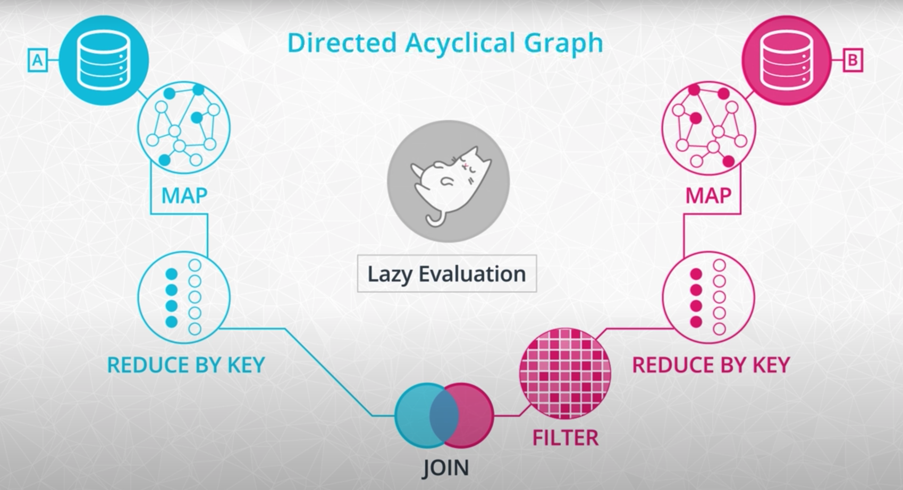

- Data formats: CSV, JSON, HTML and XML (extensible markup language is a generalized version of HTML where the tags do not have a specific meaning).

- Distributed systems often store data in a fault tolerant way by splitting chunks of the data and storing copies of these chunks across the cluster. 

- **Spark Context** connects the cluster with the application, to read data we use **Spark Session**.

- **Imperative** versus **Declarative** Programming - Spark Datadrames & Python concerns with the HOW (steps to get to a final result) whereas SQL cares with the WHAT (the final result is the focus). In most cases, a declarative system is an abstraction layer of an imperative system.

Some data wrangling functions:

General functions
We have used the following general functions that are quite similar to methods of pandas dataframes:

- select(): returns a new DataFrame with the selected columns
- filter(): filters rows using the given condition
- where(): is just an alias for filter()
- groupBy(): groups the DataFrame using the specified columns, so we can run aggregation on them
sort(): returns a new DataFrame sorted by the specified column(s). By default the second parameter 'ascending' is True.
- dropDuplicates(): returns a new DataFrame with unique rows based on all or just a subset of columns
- withColumn(): returns a new DataFrame by adding a column or replacing the existing column that has the same name. The first parameter is the name of the new column, the second is an expression of how to compute it.

**Aggregate functions**

Spark SQL provides built-in methods for the most common aggregations such as `count()`, `countDistinct()`, `avg()`, `max()`, `min()`, etc. in the pyspark.sql.functions module. These methods are not the same as the built-in methods in the Python Standard Library, where we can find `min()` for example as well, hence you need to be careful not to use them interchangeably.

In many cases, there are multiple ways to express the same aggregations. For example, if we would like to compute one type of aggregate for one or more columns of the DataFrame we can just simply chain the aggregate method after a `groupBy()`. If we would like to use different functions on different columns, `agg()`comes in handy. For example `agg({"salary": "avg", "age": "max"})` computes the average salary and maximum age.

**User defined functions (UDF)**

In Spark SQL we can define our own functions with the udf method from the pyspark.sql.functions module. The default type of the returned variable for UDFs is string. If we would like to return an other type we need to explicitly do so by using the different types from the pyspark.sql.types module.

**Window functions**

Window functions are a way of combining the values of ranges of rows in a DataFrame. When defining the window we can choose how to sort and group (with the `partitionBy` method) the rows and how wide of a window we'd like to use (described by `rangeBetween` or `rowsBetween`).

- Spark's Query optimizer (Catalyst) turns your query into an execution plan (DAG) so there is not much difference between using SQL or dataframes to perform data wrangling in Spark. 

- RDDs are a low-level abstraction of the data. In the first version of Spark, you worked directly with RDDs. You can think of RDDs as long lists distributed across various machines. You can still use RDDs as part of your Spark code although data frames and SQL are easier.

#### Lesson 3 - Debugging and Optimization

- From Local Mode to Cluster Mode:
    - Standalone mode
    - MESOS - share across team
    - YARN - share across team
- Ww will use AWS S3 and EC2, when we log in data will be pulled from S3 and spread across the cluster to be computed by the various nodes.
- AWS Elastic Map Reduce (EMR) that provides EC2 instances with Spark/Hadoop and other Big data tools already installed and configured.
- He created a Key Pair and download a .pem file onto the local machine. To prevent other users from reading,  writing or executing this key file, he run `chmod og-rwx <pem-filepath>`. AWS puts the other part of the key pair in the cluster and this ensures connection of local computer to cluster. Then created a new cluster on EMR. Then created notebooks which are stored separately from the cluster. To enable the built-in WebUI feature, we need a proxy to connect to the cluster. He added a browser extension and imported the xml file with contents given by AWS. Then he created a tunnel from the terminal to redirect traffic from our local machine to the cluster.
- For automated jobs, python scripts are preferred to Jupyter notebooks. `spark-submit` to submit the script to EMR.
- Instead of using S3 to store data, we can use HDFS installed in the cluster. 
- Spark accumulator to allow for debugging since we are accessing the master node, and not the worker nodes. The accumulator is a global variable of sorts in the master node.
- Spark WebUI shows cluster configuration, the DAG broken up into tasks related to jobs that are running. Port 8080 is the default.
- **Data skew**: workers get very different workloads depending on the data input. **Pareto principle**: 80% of your data comes from 20% of your users. To solve, we can change up the way we divide the workload between nodes. Or partition into smaller pieces.
- Big O complexity can also be tricky with Big Data.

Troubleshooting Other Spark Issues
In this lesson, we walked through various examples of Spark issues you can debug based on error messages, loglines and stack traces.

We have also touched on another very common issue with Spark jobs that can be harder to address: everything working fine but just taking a very long time. So what do you do when your Spark job is (too) slow?

**Insufficient resources**

Often while there are some possible ways of improvement, processing large data sets just takes a lot longer time than smaller ones even without any big problem in the code or job tuning. Using more resources, either by increasing the number of executors or using more powerful machines, might just not be possible. When you have a slow job it’s useful to understand:

How much data you’re actually processing (compressed file formats can be tricky to interpret). If you can decrease the amount of data to be processed by filtering or aggregating to lower cardinality. And if resource utilization is reasonable.

There are many cases where different stages of a Spark job differ greatly in their resource needs: loading data is typically I/O heavy, some stages might require a lot of memory, others might need a lot of CPU. Understanding these differences might help to optimize the overall performance. Use the Spark UI and logs to collect information on these metrics.

If you run into out of memory errors you might consider increasing the number of partitions. If the memory errors occur over time you can look into why the size of certain objects is increasing too much during the run and if the size can be contained. Also, look for ways of freeing up resources if garbage collection metrics are high.

Certain algorithms (especially ML ones) use the driver to store data the workers share and update during the run. If you see memory issues on the driver check if the algorithm you’re using is pushing too much data there.

**Data skew**
If you drill down in the Spark UI to the task level you can see if certain partitions process significantly more data than others and if they are lagging behind. Such symptoms usually indicate a skewed data set. Consider implementing the techniques mentioned in this lesson:

Add an intermediate data processing step with an alternative key. Adjust the spark.sql.shuffle.partitions parameter if necessary.

The problem with data skew is that it’s very specific to a dataset. You might know ahead of time that certain customers or accounts are expected to generate a lot more activity but the solution for dealing with the skew might strongly depend on how the data looks like. If you need to implement a more general solution (for example for an automated pipeline) it’s recommended to take a more conservative approach (so assume that your data will be skewed) and then monitor how bad the skew really is.

**Inefficient queries**

Once your Spark application works it’s worth spending some time to analyze the query it runs. You can use the Spark UI to check the DAG and the jobs and stages it’s built of.

Spark’s query optimizer is called Catalyst. While Catalyst is a powerful tool to turn Python code to an optimized query plan that can run on the JVM it has some limitations when optimizing your code. It will for example push filters in a particular stage as early as possible in the plan but won’t move a filter across stages. It’s your job to make sure that if early filtering is possible without compromising the business logic than you perform this filtering where it’s more appropriate.

It also can’t decide for you how much data you’re shuffling across the cluster. Remember from the first lesson how expensive sending data through the network is. As much as possible try to avoid shuffling unnecessary data. In practice, this means that you need to perform joins and grouped aggregations as late as possible.

When it comes to joins there is more than one strategy to choose from. If one of your data frames are small consider using broadcast hash join instead of a hash join.

#### Lesson 4 - Intro to Data Lakes

> Students will be able to understand the need for a data lake, how it is different from a data warehouse and the various options for implementing it on AWS.

Q: Is there anything wrong with the data warehouse that we need something different?

A: No, data warehousing is a rather mature field with lots of cumulative experience over the years, tried-and-true technologies. Dimensional modeling is still extremely relevant to this day. For most organizations, a data warehouse is still the best way to go, perhaps the biggest change would be going from an on-remise deployment to a cloud deployment.

### Section 5 - Data Pipelines with Airflow

#### Lesson 1 - Data Pipelines

Examples of real world data pipelines:
- Automated marketing emails
- Real-time pricing in rideshare apps
- Targeted advertising based on browsing history

> A series of steps in which data is processed. Often on schedules but also external triggers and events.  It's typically using either ETL or ELT.

- Some data pipelines may perform only a subset of ETL or ELT.

**Extract Transform Load (ETL) and Extract Load Transform (ELT)**
"ETL is normally a continuous, ongoing process with a well-defined workflow. ETL first extracts data from homogeneous or heterogeneous data sources. Then, data is cleansed, enriched, transformed, and stored either back in the lake or in a data warehouse.

"ELT (Extract, Load, Transform) is a variant of ETL wherein the extracted data is first loaded into the target system. Transformations are performed after the data is loaded into the data warehouse. ELT typically works well when the target system is powerful enough to handle transformations. Analytical databases like Amazon Redshift and Google BigQ."

What is Kafka?
"Apache Kafka is an open-source stream-processing software platform developed by LinkedIn and donated to the Apache Software Foundation, written in Scala and Java. The project aims to provide a unified, high-throughput, low-latency platform for handling real-time data feeds. Its storage layer is essentially a massively scalable pub/sub message queue designed as a distributed transaction log, making it highly valuable for enterprise infrastructures to process streaming data."

What is RedShift?
"Amazon Redshift is a fully managed, petabyte-scale data warehouse service in the cloud. You can start with just a few hundred gigabytes of data and scale to a petabyte or more... The first step to create a data warehouse is to launch a set of nodes, called an Amazon Redshift cluster. After you provision your cluster, you can upload your data set and then perform data analysis queries. Regardless of the size of the data set, Amazon Redshift offers fast query performance using the same SQL-based tools and business intelligence applications that you use today.

**Data Validation**
> The process of ensuring the data is present, correct and meaningful. Ensuring the quality of the data through automated validation checks is a critical step in building data pipelines at any organization. 

**DAGs**

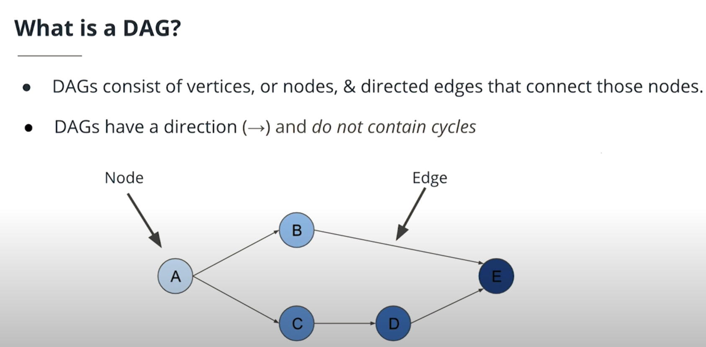

- In ETL, each step of the process typically depends on the last. Each step is a node and the dependencies on the prior steps are directed edges.

**Directed Acyclic Graphs (DAGs)**: DAGs are a special subset of graphs in which the edges between nodes have a specific direction, and no cycles exist. When we say “no cycles exist” what we mean is the nodes cant create a path back to themselves.
**Nodes**: A step in the data pipeline process.
**Edges**: The dependencies or relationships other between nodes.

- Are there real world cases where a data pipeline is not DAG?

It is possible to model a data pipeline that is not a DAG, meaning that it contains a cycle within the process. However, the vast majority of use cases for data pipelines can be described as a directed acyclic graph (DAG). This makes the code more understandable and maintainable.

- Can we have two different pipelines for the same data and can we merge them back together?

Yes. It's not uncommon for a data pipeline to take the same dataset, perform two different processes to analyze the it, then merge the results of those two processes back together.

**Apache Airflow**

> "Airflow is a platform to programmatically author, schedule and monitor workflows. Use airflow to author workflows as directed acyclic graphs (DAGs) of tasks. The airflow scheduler executes your tasks on an array of workers while following the specified dependencies. Rich command line utilities make performing complex surgeries on DAGs a snap. The rich user interface makes it easy to visualize pipelines running in production, monitor progress, and troubleshoot issues when needed. When workflows are defined as code, they become more maintainable, versionable, testable, and collaborative."
Apache Airflow was open-sourced in 2015 by Airbnb. 

What makes up Airflow:

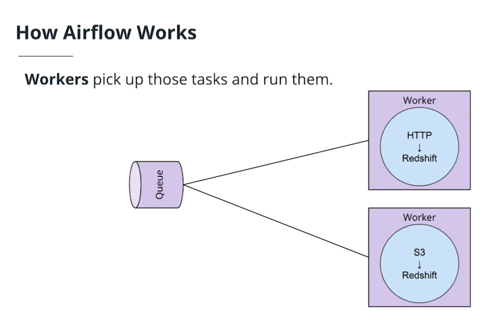

- **Scheduler** orchestrates the execution of jobs on a trigger or schedule. The Scheduler chooses how to prioritize the running and execution of tasks within the system. 
- **Work Queue** is used by the scheduler in most Airflow installations to deliver tasks that need to be run to the Workers.
- **Worker** processes execute the operations defined in each DAG. In most Airflow installations, workers pull from the work queue when it is ready to process a task. When the worker completes the execution of the task, it will attempt to process more work from the work queue until there is no further work remaining. When work in the queue arrives, the worker will begin to process it.
- **Database** saves credentials, connections, history, and configuration. The database, often referred to as the metadata database, also stores the state of all tasks in the system. Airflow components interact with the database with the Python ORM, SQLAlchemy.
- Web Interface provides a control dashboard for users and maintainers. Throughout this course you will see how the web interface allows users to perform tasks such as stopping and starting DAGs, retrying failed tasks, configuring credentials, The web interface is built using the Flask web-development microframework.

**Order of Operations For an Airflow DAG**
- The Airflow Scheduler starts DAGs based on time or external triggers.
- Once a DAG is started, the Scheduler looks at the steps within the DAG and determines which steps can run by looking at their dependencies.
- The Scheduler places runnable steps in the queue.
- Workers pick up those tasks and run them.
- Once the worker has finished running the step, the final status of the task is recorded and additional tasks are placed by the scheduler until all tasks are complete.
- Once all tasks have been completed, the DAG is complete.

Start Date: If your start date is in the past, Airflow will run your DAG as many times as there are schedule intervals between that start date and the current date.

End Date: Unless you specify an optional end date, Airflow will continue to run your DAGs until you disable or delete the DAG.

**Operators**
Operators define the atomic steps of work that make up a DAG. Airflow comes with many Operators that can perform common operations. Here are a handful of common ones:

- PythonOperator
- PostgresOperator
- RedshiftToS3Operator
- S3ToRedshiftOperator
- BashOperator
- SimpleHttpOperator
- Sensor

Task Dependencies
In Airflow DAGs:

Nodes = Tasks
Edges = Ordering and dependencies between tasks
**Task dependencies** can be described programmatically in Airflow using `>>` and `<<`

`a >> b` means a comes before b
`a << b` means a comes after b

- Connection can be accessed via **hooks**.
- You don't have to worry about how and where to store these connection strings and secrets in your code.
- We will use `PostgresHook` to interact with Redshift.

Airflow comes with many Hooks that can integrate with common systems. Here are a few common ones:

- HttpHook
- PostgresHook (works with RedShift)
- MySqlHook
- SlackHook
- PrestoHook

- Admin tab in the AriflowUI to create variables and connections. Use AWS access key and secret key from AWS to connect to AWS.

- [Here](https://airflow.apache.org/docs/stable/macros-ref) is the Apache Airflow documentation on context variables that can be included as kwargs.

#### Lesson 2 - Data Quality

**Data Lineage**

> The data lineage of a dataset describes the discrete steps involved in the creation, movement, and calculation of that dataset.

Why is Data Lineage important?
- Instilling Confidence: Being able to describe the data lineage of a particular dataset or analysis will build confidence in data consumers (engineers, analysts, data scientists, etc.) that our data pipeline is creating meaningful results using the correct datasets. If the data lineage is unclear, its less likely that the data consumers will trust or use the data.
- Defining Metrics: Another major benefit of surfacing data lineage is that it allows everyone in the organization to agree on the definition of how a particular metric is calculated.
- Debugging: Data lineage helps data engineers track down the root of errors when they occur. If each step of the data movement and transformation process is well described, it's easy to find problems when they occur.

In general, data lineage has important implications for a business. Each department or business unit's success is tied to data and to the flow of data between departments. For e.g., sales departments rely on data to make sales forecasts, while at the same time the finance department would need to track sales and revenue. Each of these departments and roles depend on data, and knowing where to find the data. Data flow and data lineage tools enable data engineers and architects to track the flow of this large web of data.

Note that Airflow does not store record of code changes. If a lot of changes os foreseen, it would be better to make a new DAG.

- Pipelines are often driven by schedules which determine what data should be analyzed and when.

**Schedules**

Pipelines are often driven by schedules which determine what data should be analyzed and when.

**Why Schedules**

- Pipeline schedules can reduce the amount of data that needs to be processed in a given run. It helps scope the job to only run the data for the time period since the data pipeline last ran. In a naive analysis, with no scope, we would analyze all of the data at all times.
- Using schedules to select only data relevant to the time period of the given pipeline execution can help improve the quality and accuracy of the analyses performed by our pipeline.
- Running pipelines on a schedule will decrease the time it takes the pipeline to run.
- An analysis of larger scope can leverage already-completed work. For. e.g., if the aggregates for all months prior to now have already been done by a scheduled job, then we only need to perform the aggregation for the current month and add it to the existing totals.

**Selecting the time period**

Determining the appropriate time period for a schedule is based on a number of factors which you need to consider as the pipeline designer.

- What is the size of data, on average, for a time period? If an entire years worth of data is only a few kb or mb, then perhaps its fine to load the entire dataset. If an hours worth of data is hundreds of mb or even in the gbs then likely you will need to schedule your pipeline more frequently.

- How frequently is data arriving, and how often does the analysis need to be performed? If our bikeshare company needs trip data every hour, that will be a driving factor in determining the schedule. Alternatively, if we have to load hundreds of thousands of tiny records, even if they don't add up to much in terms of mb or gb, the file access alone will slow down our analysis and we’ll likely want to run it more often.

- What's the frequency on related datasets? A good rule of thumb is that the frequency of a pipeline’s schedule should be determined by the dataset in our pipeline which requires the most frequent analysis. This isn’t universally the case, but it's a good starting assumption. For example, if our trips data is updating every hour, but our bikeshare station table only updates once a quarter, we’ll probably want to run our trip analysis every hour, and not once a quarter.

**Start Date**
Airflow will begin running pipelines on the start date selected. Whenever the start date of a DAG is in the past, and the time difference between the start date and now includes more than one schedule intervals, Airflow will automatically schedule and execute a DAG run to satisfy each one of those intervals. This feature is useful in almost all enterprise settings, where companies have established years of data that may need to be retroactively analyzed.

**End Date**
Airflow pipelines can also have end dates. You can use an end_date with your pipeline to let Airflow know when to stop running the pipeline. End dates can also be useful when you want to perform an overhaul or redesign of an existing pipeline. Update the old pipeline with an end date and then have the new pipeline start on the end date of the old pipeline.

- Wouldn't creating a new DAG for every feature change become cumbersome because feature changes or bugs happen all the time?
We can clear the history of ran task instances. If so, Airflow will re-run the tasks with our new code now.

- Is time the only type of partition? Can you partition other types, such as events or values?
Yes, there are also logical partition and dataset size partition. 

- `max_active_runs`: number of DAGs to run at a time. If set to 1, means you don't want to parallelize your runs, tasks can be parallelized. Example use case: if processing a month worth of data depends on the previous months worth of data.

**Schedule partitioning**
Not only are schedules great for reducing the amount of data our pipelines have to process, but they also help us guarantee that we can meet timing guarantees that our data consumers may need.

**Logical partitioning**
Conceptually related data can be partitioned into discrete segments and processed separately. This process of separating data based on its conceptual relationship is called logical partitioning. With logical partitioning, unrelated things belong in separate steps. Consider your dependencies and separate processing around those boundaries.

Also worth mentioning, the data location is another form of logical partitioning. For example, if our data is stored in a key-value store like Amazon's S3 in a format such as: `s3://<bucket>/<year>/<month>/<day>` we could say that our date is logically partitioned by time.

**Size Partitioning**
Size partitioning separates data for processing based on desired or required storage limits. This essentially sets the amount of data included in a data pipeline run. Size partitioning is critical to understand when working with large datasets, especially with Airflow. Remember that Airflow workers have limited amount of memory available for processing, on their individual system, they don't pull memory like Spark. If larger dataset is allocated compared to the amount of memory available, the worker will kill the task. In that case, we would either redesign the DAG or trigger an external framework that can handle large datasets like Spark.

**Why Data Partitioning?**

Pipelines designed to work with partitioned data fail more gracefully. Smaller datasets, smaller time periods, and related concepts are easier to debug than big datasets, large time periods, and unrelated concepts. Partitioning makes debugging and rerunning failed tasks much simpler. It also enables easier redos of work, reducing cost and time.

Another great thing about Airflow is that if your data is partitioned appropriately, your tasks will naturally have fewer dependencies on each other. Because of this, Airflow will be able to parallelize execution of your DAGs to produce your results even faster.

In `L3 solution3` we have our DAG work on logically partitioned data. The data that we use in this lesson has been pre-partitioned in Amazon Web Services (AWS) S3 by creation date. The partition follows the format: `<year>/<month>/<day>/<file>.csv`.

In practice, it is often best to have Airflow process pre-partitioned data. If your upstream data sources cannot partition data, it is possible to write an Airflow DAG to partition the data. However, it is worth keeping in mind memory limitations on your Airflow workers. If the size of the data to be partitioned exceeds the amount of memory available on your worker, the DAG will not successfully execute.

**Data Quality** is the measure of how well a dataset satisfies its intended use. Adherence to a set of requirements is a good starting point for measuring data quality. Requirements should be defined by you and your data consumers before you start creating your data pipeline. 

Examples of Data Quality Requirements:
- Data must be a certain size
- Data must be accurate to some margin of error
- Data must arrive within a given timeframe from the start of execution
- Pipelines must run on a particular schedule
- Data must not contain any sensitive information

- Service Level Agreements, or SLAs, tell Airflow when a DAG must be completed by.

#### Lesson 3 - Production Data Pipelines

**Airflow Plugins**

Airflow was built with the intention of allowing its users to extend and customize its functionality through plugins. The most common types of user-created plugins for Airflow are Operators and Hooks. These plugins make DAGs reusable and simpler to maintain.

To create custom operator, follow the steps:

1. Identify Operators that perform similar functions and can be consolidated
2. Define a new Operator in the plugins folder
3. Replace the original Operators with your new custom one, re-parameterize, and instantiate them.

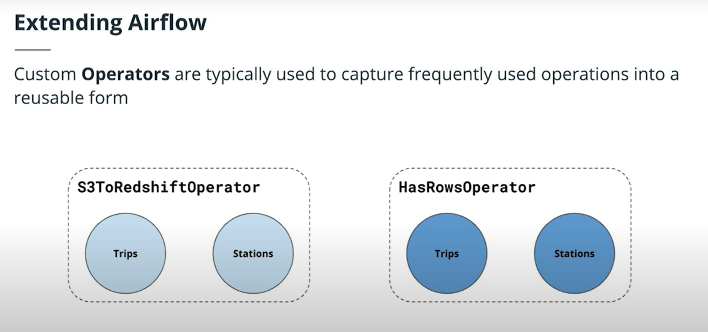

**Airflow Contrib**

Airflow has a rich and vibrant open source community. This community is constantly adding new functionality and extending the capabilities of Airflow. As an Airflow user, you should always check Airflow contrib before building your own airflow plugins, to see if what you need already exists.

Operators and hooks for common data tools like Apache Spark and Cassandra, as well as vendor specific integrations for Amazon Web Services, Azure, and Google Cloud Platform can be found in Airflow contrib. If the functionality exists and its not quite what you want, that’s a great opportunity to add that functionality through an open source contribution.

[Check out Airflow Contrib](https://github.com/apache/airflow/tree/master/airflow/contrib).

**Task Boundaries**

DAG tasks should be designed such that they are:

- Atomic and have a single purpose
- Maximize parallelism
- Make failure states obvious

Every task in your dag should perform **only one job**.

> “Write programs that do one thing and do it well.” - Ken Thompson’s Unix Philosophy

Benefits of Task Boundaries

- Re-visitable: Task boundaries are useful for you if you revisit a pipeline you wrote after a 6 month absence. You'll have a much easier time understanding how it works and the lineage of the data if the boundaries between tasks are clear and well defined. This is true in the code itself, and within the Airflow UI.
- Tasks that do just one thing are often more easily parallelized. This parallelization can offer a significant speedup in the execution of our DAGs.

**SubDAGs**

Commonly repeated series of tasks within DAGs can be captured as reusable SubDAGs. Benefits include:

- Decrease the amount of code we need to write and maintain to create a new DAG
- Easier to understand the high level goals of a DAG
- Bug fixes, speedups, and other enhancements can be made more quickly and distributed to all DAGs that use that SubDAG

**Drawbacks of Using SubDAGs**

- Limit the visibility within the Airflow UI. Rule of thumb is to only apply when there is more than one use case in your system.
- Abstraction makes understanding what the DAG is doing more difficult.
- Encourages premature optimization.

Common Questions
Can Airflow nest subDAGs? - Yes, you can nest subDAGs. However, you should have a really good reason to do so because it makes it much harder to understand what's going on in the code. Generally, subDAGs are not necessary at all, let alone subDAGs within subDAGs.

**Pipeline Monitoring**

Airflow can surface metrics and emails to help you stay on top of pipeline issues.

**SLAs**

Airflow DAGs may optionally specify an SLA, or “Service Level Agreement”, which is defined as a **time by which a DAG must complete**. For time-sensitive applications these features are critical for developing trust amongst your pipeline customers and ensuring that data is delivered while it is still meaningful. Slipping SLAs can also be **early indicators of performance problems**, or a need to scale up the size of your Airflow cluster.

**Emails and Alerts**
Airflow can be configured to send emails on DAG and task state changes. These state changes may include successes, failures, or retries. Failure emails can allow you to easily trigger alerts. It is common for alerting systems like PagerDuty to accept emails as a source of alerts. If a mission-critical data pipeline fails, you will need to know as soon as possible to get online and get it fixed.

**Metrics**
Airflow comes out of the box with the ability to send system metrics using a metrics aggregator called statsd. Statsd can be coupled with metrics visualization tools like Grafana to provide you and your team high level insights into the overall performance of your DAGs, jobs, and tasks. These systems can be integrated into your alerting system, such as pagerduty, so that you can ensure problems are dealt with immediately. These Airflow system-level metrics allow you and your team to stay ahead of issues before they even occur by watching long-term trends.