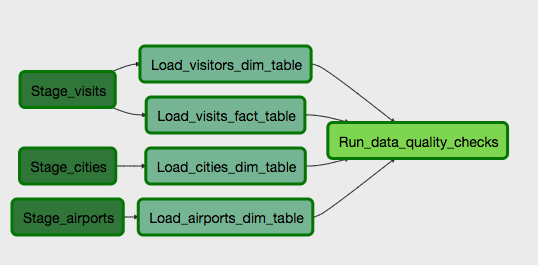

### Project Overview

This project uses a main dataset on immigration to the United States, and supplementary datasets on airport codes and U.S. city demographics. 

Here we implement a data pipeline using Apache Airflow to pipe data from the provided data source files in an efficient manner all the way to a data warehouse in an AWS Redshift cluster. This warehouse can finally be used to build insights from ad hoc queries to the cleaned and modeled data, that could be used by regulatory agencies, for example.

### Datasets

#### Immigration

The raw data is in the SAS format, partitioned by month and year for 2016. For the sake of simplicity, only the data for the month of April 2016 was used.

The dataset contains information on temporary visits to the U.S from people around the world, including age, gender, nationality of the visitors, date of arrival, departure etc. Each file (month, year) contains millions of records. There are missing values for some columns. Below is what this dataframe looks like.

I have listed below the columns that were kept for the purpose of this project alongside their descriptions. 

- `admnum`: visitor admission number
- `i94yr`: year of arrival in the US
- `i94mon`: month of arrival in the US
- `i94cit`: country of citizenship of the visitor
- `i94res`: country of residency of the visitor
- `i94port`: code of airport of arrival in the US
- `arrdate`: arrival date in the US
- `i94mode`: mode of arrival in the US (1 = air, 2 = sea, 3 = land, 9 = not reported)
- `i94addr`: US state of arrival
- `depdate`: departure date from the US
- `i94bir`: age of the visitor
- `i94visa`: visa type of the visitor collapsed in three categories (1 = business, 2 = pleasure, 3 = student)
- `gender`: gender of the visitor
- `visatype`: visa type of the visitor 

#### U.S City Demographics

The raw data is a single CSV file with U.S. city demographic data such as population size, race count, average household size, etc.  Below is what this dataframe looks like.

#### Airports

The raw data is a single CSV file with information on various airports around the globe.

### Data Wrangling

All the data wrangling was implemented in a jupyter notebook using Apache Spark due to the large datasets being handled - `data_wrangling.ipynb`.

#### Immigration Dataset

Here we have dropped columns of little value to the analysis, dropped missing values across any remaining column, renamed columns (snake case is cool) and transformed some data types (e.g. `arrdate` from timestamp to date string as `MM/DD/YYYY`).

The final dataframe was stored as a CSV file in S3 in a folder called `staging_visits`. 

If more than one time period worth of data was to be stored, we can add the month, year tuple to the filename. But since here we only used data for the month of April 2016, we kept the filename with no time information.

**U.S. City Demographic Dataset**

No columns were dropped. Missing data was dropped across any columns of interest. Columns were renamed. Original float data types could be converted to integer.

The final dataframe was stored as a CSV file in S3 in a folder called `staging_cities`.

**Airports Dataset**

Most columns were dropped given their little analytical value for this project. We wanted to use this dataset to map airport codes from the immigration dataset to corresponding city. Missing data was dropped across any columns of interest. Columns were renamed.

The final dataframe was stored as a CSV file in S3 in a folder called `staging_airports`.

#### How to run

- Create an IAM Role with permissions to read data from S3 as show below.

 

- Create an IAM User to access the AWS services.

- Launch a Redshift cluster that uses `Postgres` as a data warehouse technology 

- Launch Airflow from this capstone folder with Docker: `docker-compose up --build` and access port 8080 locally to see the webserver.

- Add connections named `aws_credentials` and `redshift` that are required to run the pipeline using the airflow webUI.
    - `aws_credentials` - type: `Amazon Web Services`, login: user access key ID and `password`: user secret key
    - `redshift` - type: `Postgres`, host: Redshift cluster endpoint, schema`: dev, login: cluster master user name, password: cluster master user password, port: 5439

- Trigger the DAG, this will load staging tables from S3 to Redshift, load dimension/fact tables and perform data quality checks.

- You can now query the fact and dimension tables using the Redshift editor!

#### Data Modeling - STAR Schema

The following STAR schema was envisioned with one fact table `visits` and three dimension tables `airports`, `visitors` and `cities`. 

#### Data Pipeline - ETL

First, the staging tables loaded in S3 - `staging_visits`, `staging_airports` and `staging_cities` - were staged in Redshift using the `StageToRedshiftOperator` operator. After that, the fact and dimension tables could be loaded one by one with the operators `LoadFactOperator` and `LoadDimensionOperator`, using insert queries defined in the `SqlQueries` class. Lastly, some data quality checks are performed through use of the `DataQualityOperator`, like null primary key values in fact/dimension tables. 

Right now, there is no schedule interval but this could easily be implemented, specially if the bigger files related to immigration data were partitioned in S3 by (month, year). We could setup a schedule to process each month at a time by passing execution time context to the operators that load the STAR schema tables. 

#### Future Scenarios

##### The data was increased by 100x

- We could partition the visits data copied to S3 by year, month and state for instance. 
- The files could be stored in parquet format to reduce I/O.
- Increase Readshift cluster capacity (more nodes, more powerful nodes)

##### The data populates a dashboard that must be updated on a daily basis by 7am every day.

- The dag can be scheduled to run at a daily interval at 7am by adding these parameters in the DAG instantiation. The number of retries is another parameter to consider here.
- It would be interesting in this case to setup emails on failures given the recurring nature of the scenario to alert engineers.
- If an email is received, the engineer could manually look into the logs for the task that failed and re-trigger after understanding the issue.

##### The database needed to be accessed by 100+ people.

- We could easily scale up our Redshift cluster, this is one of the bigger advantages of working in the cloud.
- We could use another database technology like Cassandra to optimize for reads.